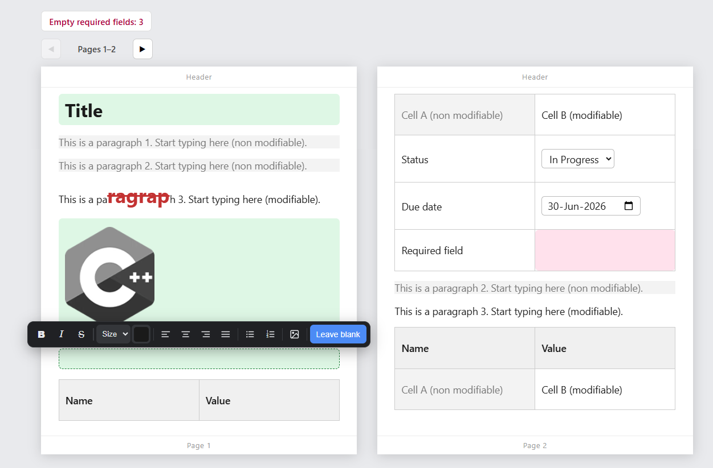
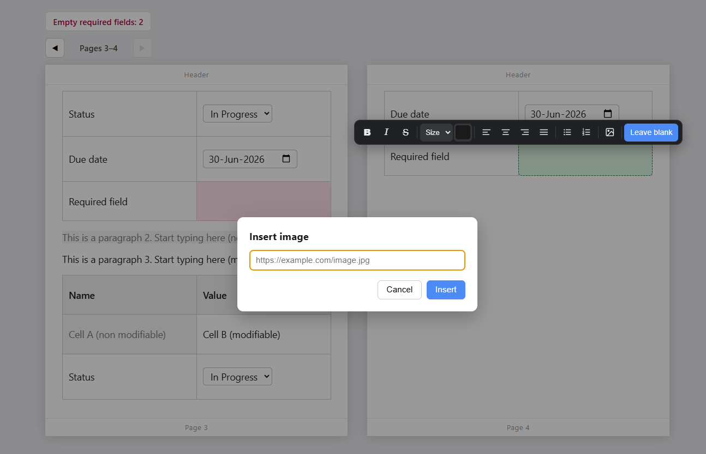

# Tiptap Pagination Demo

A rich-text editor built with [Tiptap](https://tiptap.dev/) (ProseMirror) and Vite that
lays content out as a **two-page spread** — a left and right page side by side — with
content flowing from the left page into the right, page headers/footers, tables that
split across the page boundary, and a pager to move through the document two pages at a
time. On top of the layout it adds a floating toolbar, embeddable form fields, locked and
fixed-style regions, and field-completion tracking.




## Pagination

### Two-page spread
- Content is laid out into two fixed-height pages shown side by side.
- The **left page fills first**; once it is full, content **spills into the right page** —
  driven purely by CSS multi-column layout (`column-fill: auto`), no JavaScript reflow.
- Each page is a white panel with its own inner margins, a grey gutter between the two,
  and a per-page drop shadow.
- Tunable via CSS variables: `--page-h` (page height), `--page-margin` (inner margin),
  `--page-gap` (gutter), `--page-header-h`, `--page-footer-h`.

### Page navigation (pager)
- Prev / Next controls move through the document **two pages at a time** (a spread).
- The page label and the per-page footer numbers update as you navigate
  (Pages 1–2, 3–4, …).
- Implemented by horizontally scrolling the column flow by exactly two columns while the
  page panels and header/footer stay fixed as a frame.

### Headers and footers
- Every page shows a header band at the top and a footer at the bottom.
- They are a non-editable overlay, so they never interfere with editing, and the page
  content is padded to never overlap them.

### Splittable tables
- A table that does not fit on a page **splits at a row boundary** — e.g. two rows stay on
  the left page and the rest continue on the right.
- Individual rows are never cut through the middle (`break-inside: avoid` on rows).
- Note: header rows are not repeated on the continuation (a CSS-fragmentation limitation).

## Editing features

### Floating toolbar
Appears when you click/focus in the editor. It sits just **above the active line** and is
**horizontally centered on the single page** (left or right) you are editing. It provides:
- Text styles: bold, italic, strikethrough.
- Text size (predefined sizes) and text color.
- Text alignment: left, center, right, justify.
- Lists: bulleted and numbered.
- Image insertion.
- **Leave blank** — see Tracked fields below.

It hides when you click outside the editor.

### Images
- Insert by URL through a popup dialog.
- Click any image to open a full-size preview (lightbox). Close with the backdrop,
  the close button, or the Escape key.

### Embeddable fields
- **Status dropdown:** an inline `<select>` with predefined options
  (Open / In Progress / Done). The chosen value is stored in the document and survives
  reload and HTML export.
- **Date field:** a native date input (calendar popup) whose value is persisted the same way.

### Locked regions
- A node marked as locked (`data-locked="true"`) rejects all edits — typing, deletion,
  formatting, and alignment are blocked — while the cursor can still move through it.
- Enforced with a ProseMirror transaction filter, at the model level rather than visually.

### Fixed-style regions
- Add `class="no-style"` to a node to make it **type-only**: marks (bold/italic/etc.),
  alignment, and image/field insertion are blocked, so text keeps a single fixed style.
- While the cursor is inside such a node every toolbar control is disabled except
  **Leave blank**.

### Tracked (required) fields
- Add `class="track"` to any node (paragraph, table cell, …) to track completion.
- The field is shaded **pink while empty** and **green once filled**. Text or an embedded
  image counts as filled.
- **Leave blank:** mark an intentionally-empty field as complete from the toolbar — it
  turns green (dashed) and stops counting as empty.
- A counter at the top shows how many tracked fields are still empty and updates live.

## Tech stack
- Tiptap 2 / ProseMirror
- Vite 6
- Vanilla JavaScript (no framework)

## Getting started

### Prerequisites
- Node.js 18 or newer
- npm

### Install
```bash
npm install
```

### Run the dev server
```bash
npm run dev
```
Vite prints a local URL (default `http://localhost:5173`). Open it in a browser.

### Production build
```bash
npm run build
```
Output is written to `dist/`.

### Preview the production build
```bash
npm run preview
```

## Usage notes
- Click anywhere in the editor to reveal the floating toolbar; it follows the active line
  and centers on the page you're in.
- Use the Prev / Next pager to move through the document two pages at a time.
- Locked content shows the toolbar but formatting is intentionally blocked; fixed-style
  (`no-style`) content disables everything except Leave blank.
- The dropdown and date fields are interactive — change them directly in the document.

## Project structure
```
.
├── index.html        Page shell, counter, pager, page-area + header/footer overlay
├── src/
│   ├── main.js       Editor setup, custom nodes, floating toolbar, lightbox,
│   │                 tracking, and pager logic
│   └── style.css     Page spread, toolbar, field, lightbox, and header/footer styles
├── vite.config.js    Dev server configuration
└── package.json
```

## Extending

### Mark a node as a tracked field
Add the `track` class in the content HTML:
```html
<p class="track"></p>
<td class="track"></td>
```
The pink/green styling and the empty-field counter apply automatically.

### Make a node type-only
```html
<h1 class="no-style">Title</h1>
```

### Tune the page layout
Edit the CSS variables in `src/style.css`:
```css
:root {
  --page-h: 620px;        /* page height before content spills right */
  --page-margin: 28px;    /* inner margin of each page */
  --page-gap: 32px;       /* grey gutter between the two pages */
  --page-header-h: 34px;  /* header band height */
  --page-footer-h: 30px;  /* footer band height */
}
```

### Add options to the status dropdown
Edit the `options` list in the `StatusSelect` node in `src/main.js`.
