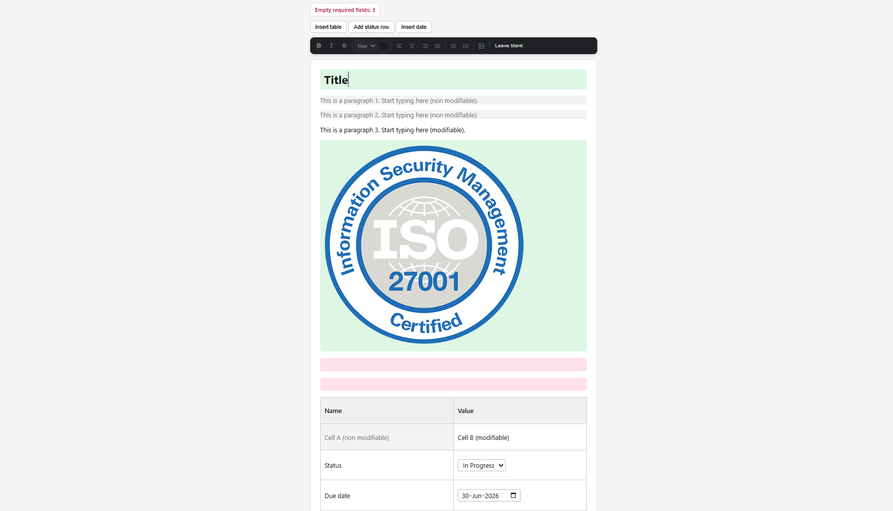

# Tiptap Editor Demo

A minimal rich-text editor built with [Tiptap](https://tiptap.dev/) (ProseMirror) and Vite.
It demonstrates a document made of a title, paragraphs, and a table, extended with a
floating toolbar, embeddable form fields, locked regions, and field-completion tracking.



## Features

### Core document
- Title (heading), paragraphs, and a resizable table.
- Plain, dependency-free build via Vite.

### Floating toolbar (bubble menu)
Appears on text selection and provides:
- Text styles: bold, italic, strikethrough.
- Text size (predefined sizes) and text color.
- Text alignment: left, center, right, justify.
- Lists: bulleted and numbered.
- Image insertion.

### Images
- Insert by URL through a popup dialog.
- Click any image to open a full-size preview (lightbox). Close with the backdrop,
  the close button, or the Escape key.

### Embeddable fields
- Status dropdown: an inline `<select>` with predefined options
  (Open / In Progress / Done). The chosen value is stored in the document and
  survives reload and HTML export.
- Date field: a native date input (calendar popup) whose value is persisted the same way.
- Toolbar buttons add a status row to the table or insert a date field at the cursor.

### Locked regions
- Any node marked as locked rejects all edits: typing, deletion, formatting, and
  alignment changes are all blocked, while the cursor can still move through it.
- Implemented with a ProseMirror transaction filter so it is enforced at the model
  level, not just visually.

### Tracked (required) fields
- Add `class="track"` to any node (paragraph, table cell, and so on) to track its
  completion state.
- The field is shaded pink while empty and green once filled. Text or an embedded
  image both count as filled.
- A counter at the top of the page shows how many tracked fields are still empty and
  updates live as fields are completed or cleared.

## Tech stack
- Tiptap 2 / ProseMirror
- Vite 6
- Vanilla JavaScript (no framework)

## Getting started

### Prerequisites
- Node.js 18 or newer
- npm

### Install
```bash
npm install
```

### Run the dev server
```bash
npm run dev
```
Vite prints a local URL (default `http://localhost:5173`). Open it in a browser.

### Production build
```bash
npm run build
```
Output is written to `dist/`.

### Preview the production build
```bash
npm run preview
```

## Usage notes
- The floating toolbar only appears when text is selected. Select text in an editable
  area to reveal it.
- Locked content shows the toolbar as well, but formatting commands are intentionally
  blocked there.
- The dropdown and date fields are interactive: change them directly in the document.

## Project structure
```
.
├── index.html        Page shell, top toolbar buttons, counter
├── src/
│   ├── main.js       Editor setup, custom nodes, toolbar, lightbox, tracking
│   └── style.css     Editor, toolbar, field, and lightbox styles
├── vite.config.js    Dev server configuration
└── package.json
```

## Extending

### Mark a node as a tracked field
Add the `track` class in the content HTML:
```html
<p class="track"></p>
<td class="track"></td>
```
The pink/green styling and the empty-field counter apply automatically.

### Add options to the status dropdown
Edit the `options` list in the `StatusSelect` node and the `Add status row` handler in
`src/main.js`.
